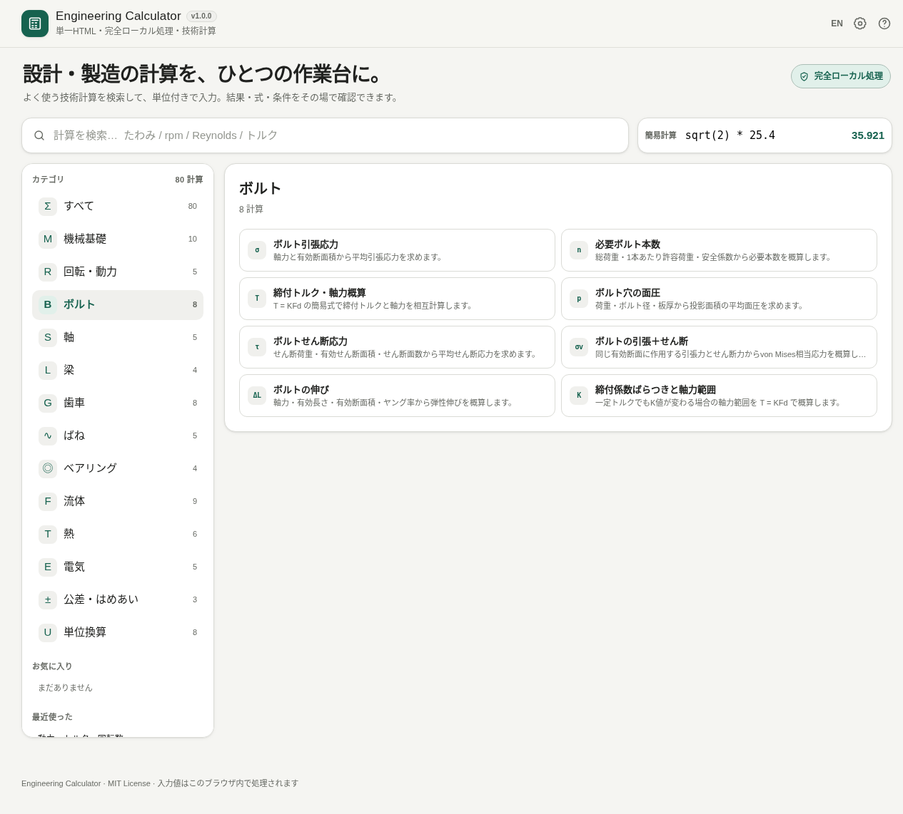

# Engineering Calculator

[](https://github.com/ttomohisa/htmlapps-engineering-calculator/actions/workflows/deploy-pages.yml)
[](LICENSE)
[](https://ttomohisa.github.io/htmlapps-engineering-calculator/)

[English README](README.md)

機械設計・製造・流体・熱・電気・公差・単位換算でよく使う技術計算を、ひとつにまとめた完全ローカル処理の単一HTMLツールです。

## 🚀 デモ

### [GitHub Pages で Engineering Calculator を開く](https://ttomohisa.github.io/htmlapps-engineering-calculator/)

GitHub Pages から最初のHTMLを読み込んだ後、計算、お気に入り、履歴、パラメータスイープ、グラフ生成、CSV生成はブラウザ内で処理されます。入力した値を実行時にサーバーへ送信しません。

[](https://ttomohisa.github.io/htmlapps-engineering-calculator/)

数値の空欄は0として扱いません。無効な入力中は結果・コピー・共有・グラフを停止し、修正すると再読み込み後もその場で再開します。計算式が許す0や負数は入力できます。

スイープの開始・終了は入力中に自動補正しません。空欄や同じ値の場合は範囲エラーを表示してグラフとCSVを停止します。異なる有効な数値へ修正するか、範囲プリセットを選び直してください。

## 主な機能

- **80種類の技術計算をひとつに集約** — 機械基礎、回転・動力、ボルト、軸、梁、歯車、ばね、ベアリング、流体、熱、電気、公差・はめあい、単位換算に対応します。
- **計算をすぐ探せる** — 日本語・英語キーワード検索、カテゴリ、お気に入り、最近使った計算に加え、`Ctrl / ⌘ + K` または `/` で検索へ移動し、`↑` / `↓` / `Enter` で候補を選べます。
- **実用単位のまま入力できる** — 入力・結果の単位を切り替えられ、別の単位換算を挟まずに計算できます。
- **前提を結果のそばで確認できる** — 主な仮定・注意を結果の直下に常時表示し、詳細な使用式と前提も展開できます。
- **材料代表値を入力補助に使える** — 鋼、ステンレス鋼、アルミニウム合金、銅、黄銅の代表値を対応する計算へ反映できます。
- **断面・はめあい・ボルト計算をまとめて扱える** — 断面特性、入力偏差によるはめあい判定、ボルト応力・軸力関連に加え、M3〜M24メートル並目のボルト補助入力とISO 286 H7/g6（1〜500 mm）の補助プリセットを利用できます。
- **条件を振って傾向を確認できる** — 数値入力を11 / 21 / 51点で変化させ、±10% / ±20% / ±50% / 0.5〜2倍の範囲プリセットまたは手入力でSVGグラフを表示できます。
- **結果やサンプル点をコピーできる** — 結果単体、入力条件＋結果、パラメータスイープのCSVをコピーできます。
- **条件を明示的に共有できる** — 現在の計算、値、単位をURL fragmentに含めた共有リンクを、操作したときだけ生成します。通常のカテゴリ・計算移動はブラウザの戻る / 進むにも対応します。
- **表示精度を選べる** — 自動、有効数字3 / 4 / 6桁から選択できます。表示だけを変更し、内部計算精度は変えません。
- **保存条件を見落としにくい** — 前回保存した入力を復元した最初の表示で通知し、その場で初期値へ戻せます。
- **単一HTML・完全ローカル処理** — 実行時の外部依存なし、日本語 / English、`file://` 直接起動、実行時通信なしです。

## すぐ使う

### Webデモを使う

[デモを開く](https://ttomohisa.github.io/htmlapps-engineering-calculator/)だけです。インストールやアカウント登録は必要ありません。

### 単一HTMLを直接使う

1. [`dist/index.html`](https://github.com/ttomohisa/htmlapps-engineering-calculator/blob/main/dist/index.html) をダウンロードします。
2. 現行ブラウザで直接開きます。
3. 検索またはカテゴリから計算を選び、値を入力します。

### 手元で単一HTMLをビルドする

1. このリポジトリをダウンロードまたはcloneします。
2. Windowsで `build-standalone.bat` をダブルクリックします。
3. `dist/index.html` に可読版、`dist/index.self-extract.html` に自己展開版が生成されます。

Python、Node.js、ローカルWebサーバーは必要ありません。

## 使い方

1. PCでは左のカテゴリ、スマホでは「探す」、または検索欄から計算を選びます。PCでは `Ctrl / ⌘ + K` または `/` で検索へフォーカスできます。
2. 必要な値を入力します。結果は入力と同時に更新されます。
3. 必要に応じて入力値・結果の単位を切り替えます。
4. 結果直下の **前提・注意** を確認し、必要に応じて **計算式・前提** を開いて詳細を確認します。
5. よく使う計算は星を押してお気に入りに登録できます。
6. **条件ごとコピー** で入力条件と結果をまとめてコピーできます。
7. **条件リンクをコピー** を使うと、現在の入力値と単位を含むURLを共有できます。
8. **条件を振ってグラフ** では、1つの数値入力を範囲で変化させ、結果の傾向を確認できます。初期範囲は現在値の±20%で、他の範囲プリセットや手入力にも切り替えられます。サンプル点はCSVとしてコピーできます。
9. ヘッダーの表示設定から有効数字を変更できます。ブラウザの戻る / 進むで、直前のカテゴリや計算へ移動できます。

### 材料プリセット

材料プリセットは代表値を入力するための補助機能です。材料証明、適用規格、メーカー資料の代わりにはなりません。

### 公差・はめあい

公差・はめあい機能は、公称寸法と上限・下限偏差から限界寸法、最大 / 最小すきま、はめあい種別を計算します。偏差は手入力できるほか、**ISO 286 H7穴 / g6軸**の補助プリセットを1〜500 mmで利用できます。プリセットは設計判断を自動化するものではないため、最終的には図面と適用規格を確認してください。

### ボルトサイズプリセット

ボルト計算ではM3〜M24のメートル並目を選択できます。呼び径を使う計算では直径を、応力断面積を使う計算ではピッチから算出した引張応力断面積 `As` を補助入力します。せん断面がねじ部ではなく軸部を通る場合などは、実際に使う断面積へ手入力で変更してください。

### パラメータスイープ

1つの入力だけを変化させ、その他の入力は現在値のまま固定します。初期範囲は現在値の**±20%**です。±10%、±20%、±50%、0.5〜2倍、手入力から選び、11 / 21 / 51点でサンプリングできます。軸の単位は現在選択中の入出力単位に追従します。

## GitHub Pages で公開する

このリポジトリには、単一HTMLをビルドして `dist/` をGitHub Pagesへ公開するWorkflowが含まれています。

1. リポジトリを `htmlapps-engineering-calculator` としてGitHubへpushします。
2. **Settings → Pages → Build and deployment → Source** で **GitHub Actions** を選びます。
3. `main` へpushするか、Actionsから **Deploy standalone app to GitHub Pages** を手動実行します。
4. 成功すると `https://ttomohisa.github.io/htmlapps-engineering-calculator/` で利用できます。

Workflowではリポジトリチェック、単一HTMLの再ビルド、生成物の検証、Pagesへの公開を行います。

## 開発・ビルド構成

```text
.
├─ src/index.template.html        # アプリ本体の編集対象
├─ app.config.json                # アプリ情報・ビルド設定
├─ dependencies.json              # 固定依存関係（現在はなし）
├─ build-standalone.bat           # Windows向けビルド入口
├─ build-standalone.ps1           # 単一HTMLビルダー
├─ scripts/                       # 検証・自己展開版生成
├─ docs/FORMULA_REFERENCES.md     # 計算式の参考資料・注記
├─ dist/index.html                # 可読な単一HTML
└─ dist/index.self-extract.html   # 自己展開単一HTML
```

編集対象は `src/index.template.html` です。`dist/` 内の生成HTMLを直接編集しないでください。

## プライバシーと実行時通信

生成HTMLのContent Security Policyには `connect-src 'none'` を設定しています。通常利用時は以下のように動作します。

- 入力値の計算はブラウザ内で行います。
- お気に入り、最近使った計算、保存した入力値はブラウザのローカルストレージへ保存します。
- パラメータスイープとグラフ生成もローカル処理です。
- 解析・テレメトリは含みません。
- 条件共有リンクはユーザーが明示的に操作したときだけ生成します。URL fragmentには現在値と単位が含まれるため、リンクを受け取った相手はその条件を確認できます。

GitHub Pages版では最初のHTML取得だけ通信が発生します。ネットワークから切り離して使う場合は `dist/index.html` をローカルで開いてください。

## 制限事項

- 結果は一般式による技術計算値です。適用規格、正式な設計手順、安全審査、法令要求の代わりにはなりません。
- 材料プリセットは代表値で、特定材質、熱処理、温度、メーカー仕様を保証しません。
- H7/g6補助プリセットはISO 286のH7穴 / g6軸、基準寸法1〜500 mmを対象にした入力補助です。他のはめあい、公差等級、規格体系を自動選定する機能ではありません。
- ボルトサイズプリセットはM3〜M24のメートル並目と引張応力断面積の補助です。強度区分、ねじの完全な幾何、公差、締結体剛性や接合面条件を自動判定しません。
- ベアリング係数、許容応力、摩擦係数、配管粗さなどは、用途に応じてメーカー資料や設計条件から入力する必要があります。
- 梁、ばね、ボルト、流体、熱計算には各計算で示す簡略化条件があります。実際の設計条件に合うか確認してください。
- パラメータスイープは式の数値傾向を見る機能です。最適化、不確かさ解析、FEA、CFD、疲労評価、規格適合判定を自動で行うものではありません。

## 依存ライブラリ

現在、**実行時のサードパーティライブラリはありません**。計算、SVG図、SVGグラフ、検索、保存、条件共有、CSV生成は単一HTML内のコードで実装しています。

追加の表記・参考資料は [THIRD_PARTY_NOTICES.md](THIRD_PARTY_NOTICES.md) と [docs/FORMULA_REFERENCES.md](docs/FORMULA_REFERENCES.md) を参照してください。

## Contributing

不具合報告や機能提案はGitHub Issuesから歓迎します。開発時の方針は [CONTRIBUTING.md](CONTRIBUTING.md) を参照してください。

## License

Copyright © 2026 ttomohisa

[MIT License](LICENSE) で公開しています。

## 回帰テスト

`scripts/check-repository.ps1` はNode.js 18以降を使用し、ソースとビルド済みHTMLの両方で依存パッケージ不要の計算機回帰テストを実行します。単独実行: `node --test tests/calculator-input-recovery.test.mjs`。ビルド後は `Copy-Item dist/index.html engineering-calculator.html` でルート配布ファイルを更新し、生成HTMLとバイト単位で一致させます。
